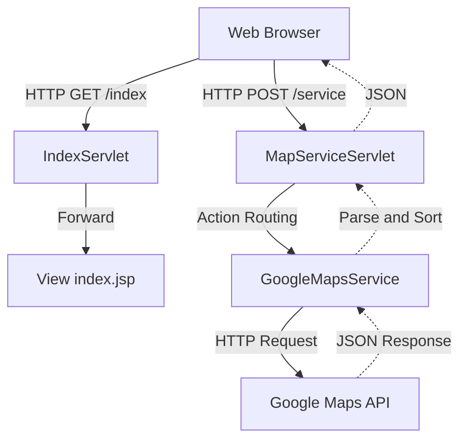

# Signatural API NEWS (Map Practice)

본 프로젝트는 Google Maps API(Geocoding, Directions, Places)를 활용한 Java 기반 웹 애플리케이션입니다. 전통적인 신문 테마를 차용하였으며, 엄격한 MVC (Model-View-Controller) 아키텍처 패턴을 준수하여 설계 및 구현되었습니다.

## 1. 아키텍처 개요 (MVC 패턴)

본 애플리케이션은 사용자 요청 처리(Controller), 비즈니스 로직 연산(Model), 화면 렌더링(View)을 완전히 분리하여 유지보수성과 보안성을 극대화한 구조를 가집니다.



- **Controller (컨트롤러)**
  - `IndexServlet.java`: 초기 페이지 로드 시 애플리케이션 설정(API Key, 언어)을 읽어 View(JSP)로 전달하는 프론트 컨트롤러.
  - `MapServiceServlet.java`: 프론트엔드의 비동기 API 요청을 수신하고, 페이로드 내 `action` 값에 따라 적절한 Service 메서드로 분기(Routing)하는 REST API 컨트롤러.
- **Model (모델 / 서비스)**
  - `GoogleMapsService.java`: 외부 Google API와의 통신을 담당하며, 응답된 데이터를 파싱하고 정렬(하버사인 거리 계산, 베이지안 리뷰 페널티 알고리즘 등)하는 핵심 비즈니스 로직 수행.
  - `ConfigManager.java`: 서버 내부의 `config.properties` 파일에서 환경변수를 로드하는 싱글톤 객체.
- **View (뷰)**
  - `index.jsp`: `/WEB-INF/views/` 내부에 은닉되어 직접 접근이 차단됨. 내부에 Java 코드(Scriptlet)를 포함하지 않고 EL(Expression Language)만 사용하여 데이터를 바인딩함.
  - **프론트엔드 (JS/CSS)**: Vanilla JS 기반으로 모듈화되어 있으며, 서버로부터 전달받은 JSON 데이터를 파싱하여 화면(DOM)을 업데이트함.

## 2. 파일 및 디렉토리 구조

```text
mapPractice/
├── WEB-INF/
│   ├── web.xml                      # 서블릿 매핑 및 환경 설정 파일
│   ├── config.properties            # API Key 등 환경 변수 (보안을 위해 Git 제외 권장)
│   ├── views/
│   │   └── index.jsp                # 메인 View 파일 (외부 직접 접근 차단)
│   └── src/                         # Java 백엔드 소스코드
│       ├── controller/
│       │   ├── IndexServlet.java      # 메인 페이지 라우터
│       │   └── MapServiceServlet.java # API 페이로드 라우터
│       ├── service/
│       │   └── GoogleMapsService.java # 비즈니스 로직 및 외부 API 통신
│       └── config/
│           └── ConfigManager.java     # 설정 로드 관리자
├── css/
│   └── style.css                    # UI 스타일링 (신문 테마)
└── js/                              # 프론트엔드 자바스크립트 모듈
    ├── main.js                      # JS 진입점 (Entry Point)
    ├── config/
    │   ├── state.js                 # 구글 맵 인스턴스 전역 상태 관리
    │   └── i18n.js                  # 다국어(EN/KR) 번역 사전 데이터
    ├── features/
    │   ├── geocode.js               # 장소 검색 및 마커 생성
    │   ├── directions.js            # 길찾기 통신 및 Polyline 수동 렌더링
    │   └── places.js                # 주변 식당 검색 및 모달(Modal) 데이터 렌더링
    └── ui/
        ├── tabs.js                  # 탭 네비게이션 제어
        └── i18n_apply.js            # 다국어 사전 DOM 치환
```

## 3. 주요 기능
1. **장소 검색 (Geocoding)**: 주소 문자열을 위도/경도 좌표로 변환 후 지도 중심 이동 및 마커 표시.
2. **길찾기 (Directions)**: 대중교통(Transit) 기반 최적 경로 탐색. 보안을 위해 백엔드에서 Google API와 통신하며, 수신한 Polyline 데이터를 프론트엔드에서 디코딩하여 수동 렌더링함.
3. **주변 식당 (Places)**: 특정 반경 내 상점 검색. 자체 Java 서버 내에서 하버사인(Haversine) 알고리즘을 이용한 물리적 거리 계산 및 별점 페널티 기반 정렬 수행.
4. **다국어 지원 (i18n)**: URL Parameter(`?lang=ko` / `en`) 기반 다국어 지원. 커스텀 UI 텍스트 치환 및 Google Maps 응답 데이터(도로명, 길안내 텍스트 등) 언어 일괄 변경 적용.
